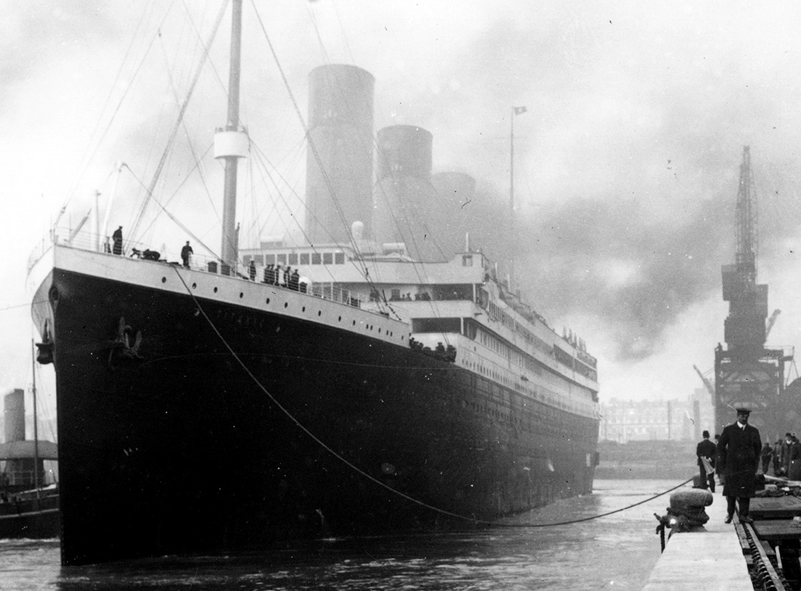

```{r setup, include=FALSE}
knitr::opts_chunk$set(echo = TRUE)
```


```{r pressure, echo=FALSE, fig.cap="The RMS Titanic in port during 1912 (Source: Universal History Archive/Getty Images)", out.width = '100%'}

```

# An overview

The infamous Titanic disaster that occurred in 1912 took the life of at least 1,500 people, both passengers and crews alike. When the ship sank.

The Titanic competition in Kaggle is a good place to start when we first learn about classification in machine learning. The purpose of this project itself is to predict whether a passenger will survived or not, based on the given information or variables. There are three data sets that we will use here, namely the *train*, *test* and *gender submission* data sets. For Titanic Survival Prediction Part 1, we will try to compare model performances from two different algorithms that we can use in classification, that is the logistic regression and k-Nearest Neighbor (kNN). 


# Let's get started!

## Import files and packages

```{r, message=FALSE, warning=FALSE}
# Import packages
library(readr)
library(dplyr)
library(tidyverse)
library(tracerer) # to automatically calculate mode
library(caret) # model evaluation
library(psych) # create dummy variables
library(class) # kNN
```

```{r, message=FALSE, warning=FALSE}
# Import files
data_train <- read_csv("Titanic/train.csv")
```
```{r}
head(data_train)
```


Columns description:

* Survived: Survival. 0 = No, 1 = Yes.
* Pclass: Ticket class. A proxy for socio-economic status (SES)
  - 1st = Upper
  - 2nd = Middle
  - 3rd = Lower
* Sex: Sex
* Age: Age in years. Age is fractional if less than 1. If the age is estimated, is it in the form of xx.5
* SibSp: of siblings / spouses aboard the Titanic. The dataset defines family relations in this way:
  - Sibling = brother, sister, stepbrother, stepsister
  - Spouse = husband, wife (mistresses and fiancés were ignored)
* parch: of parents / children aboard the Titanic. The dataset defines family relations in this way:
  - Parent = mother, father
  - Child = daughter, son, stepdaughter, stepson
  - Some children travelled only with a nanny, therefore parch=0 for them.
* Ticket: Ticket's number
* Fare: Passenger fare
* Cabin: Cabin's number
* Embarked: Port of embarkation.
  - C = Cherbourg
  - Q = Queenstown
  - S = Southampton


## Data wrangling

```{r}
head(data_train)
```

```{r}
glimpse(data_train)
```

```{r}
# maximum missing values that we tolerated for each columns
nrow(data_train)*0.05

# check missing values from all columns
colSums(is.na(data_train))
```

For data wrangling, we would need to:

1. Change columns to its correct data types
  * Columns that need to be converted to factor: **Survived**, **Pclass**, **Sex** and **Embarked**.
2. Drop column `Cabin` and `Name`.
  * For `Cabin`, we will drop it since it has a total of missing values that is more than half of the total observations.
  * In the case of the `Name` column, to be honest I think it actually stored valuable information that we can use to explore the family relations among the titanic passengers. It is a very useful variable to use when we are exploring the data sets with more advanced algorithm in classification. We could have keep it as it is but since we are using a much simpler model, that is with logistic regression and kNN, we would not use it to create our models.


```{r}
# change columns data types into the correct ones
titanic_train <- data_train %>% 
  mutate_at(.vars = c("Survived", "Pclass", "Sex", "Embarked"), .funs = as.factor) %>% 
  select(-c(Cabin, Name, Ticket))

head(titanic_train)
```


## Treatment for missing values

```{r}
# check again for columns that have missing values
colSums(is.na(titanic_train))
```


We have located the columns that have missing values and those columns consisted of **Age** and **Embarked**. Since **Embarked** is a factor, we will replace the two missing values with its mode or the value that appeared most frequently. As for the **Age** column, we can either replace the 177 missing values with the mean or median. If there's no outlier, then we'll replace them with mean but if it does, then it is better to use the median number instead.


```{r}
# check the mode for column `Embarked`
table(titanic_train$Embarked)
```
Turns out, most of the passengers in the Titanic embarked from the Southampton (S) port with 644 passengers in total.

```{r}
# replace missing values in column `Embarked` with the mode (Southampton port)
which(is.na(titanic_train$Embarked)) # locate missing values index in Embarked

titanic_train <- titanic_train %>% 
  mutate(Embarked = if_else(is.na(Embarked), calc_mode(Embarked), Embarked))
```
```{r}
# check outliers in Age
boxplot(titanic_train$Age)
```

Since we have plenty of outliers in the `Age` column, it is better to replace the missing values with the median.

```{r}
# replace missing values in column `Age` with the median
median(titanic_train$Age, na.rm = T) # check the median age from all passengers without taking into account the NA

titanic_train <- titanic_train %>% 
  mutate(Age = if_else(is.na(Age), median(Age, na.rm = T), Age))
```

```{r}
# check again whether we still have missing values or not
anyNA(titanic_train)
```

Great! All variables within the **titanic_train** dataframe is now stored in their correct data types and has no more missing values. So far, we have performed data cleansing and we're ready to go and create classification models from it.

```{r}
titanic_train
```

# Machine Learning

As we have mentioned earlier, we will create a prediction of whether a passenger will survived or not using two different classification models; the logistic regression and the k-Nearest Neighbor (kNN).

The first step in creating a prediction with both models is to decide which of the variable that we want to set as the target and the predictor variables. Now, because our aim is to predicted which passengers that will survived or not, we will use the **Survived** column as the **target variable** while the rest of the variables will be used as the predictors.

1. **Target variable**: Column `Survived`. We will also take "1" (Survived) as the positive class for our models.
2. **Predictor variable(s)**: All variables beside column `Survived`

Check whether the target variables have balanced or imbalanced class.
```{r}
prop.table(table(titanic_train$Survived))
```

The proportion for our target class seems to be quite balanced and at this stage, we won't try to downsampling / upsampling the target variable just yet.


## Logistic Regression


Since we were already provided with the separate .csv files for the training and test data set, we don't have to go through the cross-validation step anymore and we could import the **test.csv** and the **gender_submission.csv**  files to our environment.

```{r, message=FALSE, warning=FALSE}
# importing test.csv and the gender_submission.csv
data_test <- read_csv("Titanic/test.csv")

gender_sub <- read_csv("Titanic/gender_submission.csv")

#left join column 'Survived' in gender_sub to data_test
data_test_merge <- merge(data_test, gender_sub, by = "PassengerId")
```

```{r}
glimpse(data_test_merge)
```
```{r}
colSums(is.na(data_test_merge))
```


```{r}
# change columns data types into the correct ones
titanic_test <- data_test_merge %>% 
  mutate_at(.vars = c("Survived", "Pclass", "Sex", "Embarked"), .funs = as.factor) %>% 
  select(-c(Cabin, Name, Ticket))

head(titanic_test)
```

For the titanic_test data set, the missing values can be located in columns **Age** and **Fare**. Since column **Fare** data type is a numeric, we'll decide whether to replace the missing values with its mean or median.

```{r}
# Check for outliers in columns 'Age' and 'Fare'
boxplot(titanic_test$Age)
boxplot(titanic_test$Fare)
```
Both columns have outliers.

```{r}
# Check the range of fare
range(titanic_test$Fare, na.rm = T)

# Check the range of passenger's age
range(titanic_test$Age, na.rm = T)
```

```{r}
titanic_test %>% 
  filter(Fare == 0)
```

```{r}
# Treatment for missing values in column `Age` and `Fare`

titanic_test <- titanic_test %>% 
  mutate(Age = if_else(is.na(Age), median(Age, na.rm = T), Age),
         Fare = if_else(is.na(Fare), median(Fare, na.rm = T), Fare))
```

```{r}
anyNA(titanic_test)
```

### Create model

```{r}
titanic_train
```
```{r}
prop.table(table(titanic_train$Survived))
```


```{r}
model_lm <- glm(Survived~., data = titanic_train, family = "binomial")
summary(model_lm)
```

Several things to concluded from the summary above:

1. Column PClass, Sex, Age, SibSp and Embarked are the columns that significantly affected our target variable with p-value that has a score of less than 0.05.
3. AIC or the information loss for model_lm is 806.97 while it has a residual deviance of 784.97.

The Estimate number display the log of odds for each columns. If we want to interpreted it, we can use the *exp()* function to converted them to their odds.


```{r}
# log of odds -> odds (for each predictor variables)
data.frame(odds = exp(model_lm$coefficients))
```

### Feature selection

```{r}
# feature selection
model_all <- step(model_lm, direction = "backward", trace = F)
summary(model_all)
```

```{r}
# model evaluation with aic
model_lm$aic
model_all$aic
```

Based on the AIC, model_all has a slightly lower number compared to model_lm. Therefore, we will use model_all instead of model_sm since lower AIC number means that our model has a better performance.


### Predict

Add new variable to titanic_test that stored the probability of our prediction.

```{r}
titanic_test$Prediction.Prob <- predict(object = model_all, newdata = titanic_test, type = "response")
```

Create another variable that contains the label of survival prediction for each passengers. If a passenger has a probability of more than 0.5, we would labeled them with "1" (positive class/survived). But, if they scored less than 0.5, they would be put in the negative class ("0"/Not survived). 

```{r}
titanic_test$Prediction.Label <- ifelse(titanic_test$Prediction.Prob > 0.5, "1","0")
head(titanic_test)
```

```{r}
# change Prediction.Label variable to factor
titanic_test <- titanic_test %>% 
  mutate(Prediction.Label = as.factor(Prediction.Label))
```


### Model evaluation

After we have done with making our prediction, we are going to evaluate our model by using the confusion matrix from package *caret*.

```{r}
# from package `caret`
lm_model_eval <- confusionMatrix(data = titanic_test$Prediction.Label,
                                 reference = titanic_test$Survived,
                                 positive = "1")
lm_model_eval
```

From the summary above, we can see that our model is able to correctly predict both its positive and negative classes. But unfortunately, the number of the correct prediction from the true positive class (144) is way lower than the negative class (246). It means our model is better at predicting from one class only, which is the negative class. Ideally, we want our model to learn equally well from both classes and not limited to one class only.

Although the target class is considered to be imbalanced, it turns out that our model has a quite high score both for its recall (Sensitivity) and precision (Pos Pred Value). Since our target class isn't that balanced, we wouldn't use Accuracy as the metrics for our model evaluation. Instead, we will focus on the other two metrics, namely recall and precision.


## k-Nearest Neighbor (kNN)

```{r}
glimpse(titanic_train)
```

```{r}
titanic.train <- titanic_train %>% 
  mutate(Sex = if_else(Sex == "male", 0, 1)) %>%
  select(-Embarked)
         
head(titanic.train)
```


```{r}
prop.table(table(titanic.train$Survived))
```

Before we proceed with creating a kNN model, we first need to check the range of each variables. If the predictor variables have a huge gap in terms of range, then we would have to perform a normalization or scaling. This is done particularly because kNN 

```{r}
summary(titanic.train)
```

Summary from titanic.train:
1. The passengers in the titanic.train data set only consisted of those from the 1st (upper) and 2nd (middle) class.
2. The age of the titanic.train passengers range from 0.42 - 80 years old with a median of 28 years old.
3. Judging from the **SibSp** column, 50% of the passengers were travelling alone without being accompanied by a family member.

```{r}
# data wrangling
# replace value "male" with 0 and "female" with 1 in column Sex
# remove other categorical data and predictions result from previous titanic_test dataset that we used for logistic regression

titanic.test <- titanic_test %>% 
  mutate(Sex = if_else(Sex == "male", 0, 1)) %>% 
  select(-c(Embarked, Prediction.Prob, Prediction.Label))

head(titanic.test)
```

Create dummy variables that have more than two levels.

```{r}
# from package `psych`
# create dummy variable from column `Pclass` in titanic.train
Pclass_train <- as.data.frame(dummy.code(titanic.train$Pclass))

# create dummy variable from column `Pclass` in titanic.test
Pclass_test <- as.data.frame(dummy.code(titanic.test$Pclass))
```

Tutorials on handling factor variables that have more than two levels: https://quantdev.ssri.psu.edu/sites/qdev/files/kNN_tutorial.html

```{r, message=FALSE, warning=FALSE}
# rename columns from Pclass_train
Pclass_train <- Pclass_train %>%
  rename("Pclass.Up" = "1",
         "Pclass.Mid" = "2",
         "Pclass.Low" = "3")

# rename columns from Pclass_test
Pclass_test <- Pclass_test %>%
  rename("Pclass.Up" = "1",
         "Pclass.Mid" = "2",
         "Pclass.Low" = "3")

head(Pclass_train)
```


```{r}
# combined dummy variables to the titanic.train and titanic.test dataset
train_data <- cbind(titanic.train, Pclass_train)
test_data <- cbind(titanic.test, Pclass_test)

# drop the original Pclass column
train_data1 <- train_data[, -3]
test_data1 <- test_data[, -2]

head(train_data1)
```

```{r}
# filter out predictor variables
titanic_train_x <- train_data1 %>% select_if(is.numeric)
titanic_test_x <- test_data1 %>% select_if(is.numeric)

# filter out target variables
titanic_train_y <- train_data1[,"Survived"]
titanic_test_y <- test_data1[,"Survived"]
```


```{r}
head(titanic_train_x)
head(titanic_train_y)
```


```{r}
# scaling
titanic_train_xs <- scale(titanic_train_x)
  
titanic_test_xs <- scale(titanic_test_x, 
                      center = attr(titanic_train_xs,"scaled:center"), # center = mean
                      scale = attr(titanic_train_xs, "scaled:scale")) # scale = standard deviation

```

```{r}
head(titanic_train_xs)
head(titanic_test_xs)
```


### Predict

```{r}
# find optimum k
sqrt(nrow(titanic_train_xs))
```
When we have an even number for target class, we should use an odd number for its optimum k and vice versa.

* Total of target class: 2 *(even number)*
* K: 29 *(odd number)*

```{r}
titanic_pred <- knn(train = titanic_train_xs,
                   test = titanic_test_xs,
                   cl = titanic_train_y,
                   k = 29)
```


```{r}
titanic_pred
```

```{r}
knn_model_eval <- confusionMatrix(data = as.factor(titanic_pred), reference = titanic_test_y, positive = "1")
knn_model_eval
```

We'll measure how well our kNN model was able to learn and correctly predict the target variables by using the confusion matrix model evaluation, just like when we did for logistic regression. Based on the three above metrics, kNN has a quite good performance with a recall of 79.61%, a precision of 85.21% and 87.56$ of accuracy. Now we'll compare the performance from both models between the logistic regression and the kNN.

```{r}
# comparing the model performances between knn and logistic regression
# model evaluation when we use logistic regression
lm_model_eval
```


# Conclusion

We have gone through the process of creating a model with logistic regression and k-Nearest Neighbor (kNN) to find out which of the two models that can better predict whether a Titanic passenger will survived or not. As it turns out, the model that was created with logistic regression has a better result in predicting the survival rate of a passenger in comparison to the one that we made with kNN. Since the target variables and the TN (true negative) / TF (true false) class is imbalanced, we chose to use both recall and precision as our model evaluation metrics. The model with logistic regression scored higher than the kNN in both metrics. It has a recall number of 94.74% and 87.8% for precision while kNN has 79.61% for its recall and 85.21% for precision.


