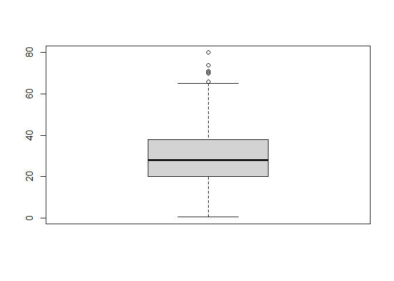
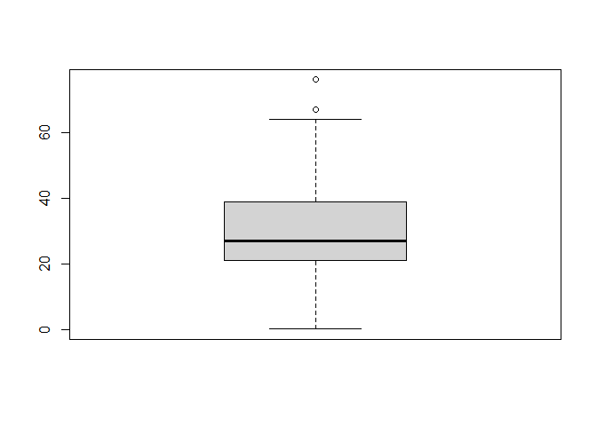
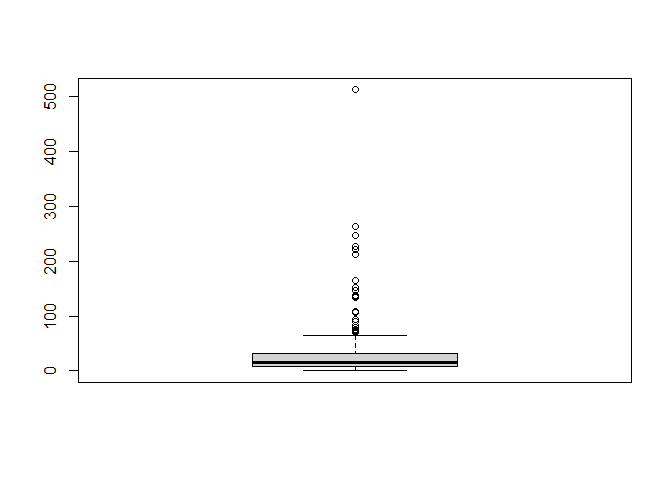

Titanic Survival Prediction Pt. 1
================
Syarifah Rizki
2/17/2022


# An overview

The infamous Titanic disaster that occurred in 1912 took the life of at
least 1,500 people, both passengers and crews alike. When the ship sank.

The Titanic competition in Kaggle is a good place to start when we first
learn about classification in machine learning. The purpose of this
project itself is to predict whether a passenger will survived or not,
based on the given information or variables. There are three data sets
that we will use here, namely the *train*, *test* and *gender
submission* data sets. For Titanic Survival Prediction Part 1, we will
try to compare model performances from two different algorithms that we
can use in classification, that is the logistic regression and k-Nearest
Neighbor (kNN).

# Let’s get started!

## Import files and packages

``` r
# Import packages
library(readr)
library(dplyr)
library(tidyverse)
library(tracerer) # to automatically calculate mode
library(caret) # model evaluation
library(psych) # create dummy variables
library(class) # kNN
```

``` r
# Import files
data_train <- read_csv("Titanic/train.csv")
```

``` r
head(data_train)
```

    ## # A tibble: 6 x 12
    ##   PassengerId Survived Pclass Name    Sex     Age SibSp Parch Ticket  Fare Cabin
    ##         <dbl>    <dbl>  <dbl> <chr>   <chr> <dbl> <dbl> <dbl> <chr>  <dbl> <chr>
    ## 1           1        0      3 Braund~ male     22     1     0 A/5 2~  7.25 <NA> 
    ## 2           2        1      1 Cuming~ fema~    38     1     0 PC 17~ 71.3  C85  
    ## 3           3        1      3 Heikki~ fema~    26     0     0 STON/~  7.92 <NA> 
    ## 4           4        1      1 Futrel~ fema~    35     1     0 113803 53.1  C123 
    ## 5           5        0      3 Allen,~ male     35     0     0 373450  8.05 <NA> 
    ## 6           6        0      3 Moran,~ male     NA     0     0 330877  8.46 <NA> 
    ## # ... with 1 more variable: Embarked <chr>

Columns description:

-   Survived: Survival. 0 = No, 1 = Yes.
-   Pclass: Ticket class. A proxy for socio-economic status (SES)
    -   1st = Upper
    -   2nd = Middle
    -   3rd = Lower
-   Sex: Sex
-   Age: Age in years. Age is fractional if less than 1. If the age is
    estimated, is it in the form of xx.5
-   SibSp: of siblings / spouses aboard the Titanic. The dataset defines
    family relations in this way:
    -   Sibling = brother, sister, stepbrother, stepsister
    -   Spouse = husband, wife (mistresses and fiancés were ignored)
-   parch: of parents / children aboard the Titanic. The dataset defines
    family relations in this way:
    -   Parent = mother, father
    -   Child = daughter, son, stepdaughter, stepson
    -   Some children travelled only with a nanny, therefore parch=0 for
        them.
-   Ticket: Ticket’s number
-   Fare: Passenger fare
-   Cabin: Cabin’s number
-   Embarked: Port of embarkation.
    -   C = Cherbourg
    -   Q = Queenstown
    -   S = Southampton

## Data wrangling

``` r
head(data_train)
```

    ## # A tibble: 6 x 12
    ##   PassengerId Survived Pclass Name    Sex     Age SibSp Parch Ticket  Fare Cabin
    ##         <dbl>    <dbl>  <dbl> <chr>   <chr> <dbl> <dbl> <dbl> <chr>  <dbl> <chr>
    ## 1           1        0      3 Braund~ male     22     1     0 A/5 2~  7.25 <NA> 
    ## 2           2        1      1 Cuming~ fema~    38     1     0 PC 17~ 71.3  C85  
    ## 3           3        1      3 Heikki~ fema~    26     0     0 STON/~  7.92 <NA> 
    ## 4           4        1      1 Futrel~ fema~    35     1     0 113803 53.1  C123 
    ## 5           5        0      3 Allen,~ male     35     0     0 373450  8.05 <NA> 
    ## 6           6        0      3 Moran,~ male     NA     0     0 330877  8.46 <NA> 
    ## # ... with 1 more variable: Embarked <chr>

``` r
glimpse(data_train)
```

    ## Rows: 891
    ## Columns: 12
    ## $ PassengerId <dbl> 1, 2, 3, 4, 5, 6, 7, 8, 9, 10, 11, 12, 13, 14, 15, 16, 17,~
    ## $ Survived    <dbl> 0, 1, 1, 1, 0, 0, 0, 0, 1, 1, 1, 1, 0, 0, 0, 1, 0, 1, 0, 1~
    ## $ Pclass      <dbl> 3, 1, 3, 1, 3, 3, 1, 3, 3, 2, 3, 1, 3, 3, 3, 2, 3, 2, 3, 3~
    ## $ Name        <chr> "Braund, Mr. Owen Harris", "Cumings, Mrs. John Bradley (Fl~
    ## $ Sex         <chr> "male", "female", "female", "female", "male", "male", "mal~
    ## $ Age         <dbl> 22, 38, 26, 35, 35, NA, 54, 2, 27, 14, 4, 58, 20, 39, 14, ~
    ## $ SibSp       <dbl> 1, 1, 0, 1, 0, 0, 0, 3, 0, 1, 1, 0, 0, 1, 0, 0, 4, 0, 1, 0~
    ## $ Parch       <dbl> 0, 0, 0, 0, 0, 0, 0, 1, 2, 0, 1, 0, 0, 5, 0, 0, 1, 0, 0, 0~
    ## $ Ticket      <chr> "A/5 21171", "PC 17599", "STON/O2. 3101282", "113803", "37~
    ## $ Fare        <dbl> 7.2500, 71.2833, 7.9250, 53.1000, 8.0500, 8.4583, 51.8625,~
    ## $ Cabin       <chr> NA, "C85", NA, "C123", NA, NA, "E46", NA, NA, NA, "G6", "C~
    ## $ Embarked    <chr> "S", "C", "S", "S", "S", "Q", "S", "S", "S", "C", "S", "S"~

``` r
# maximum missing values that we tolerated for each columns
nrow(data_train)*0.05
```

    ## [1] 44.55

``` r
# check missing values from all columns
colSums(is.na(data_train))
```

    ## PassengerId    Survived      Pclass        Name         Sex         Age 
    ##           0           0           0           0           0         177 
    ##       SibSp       Parch      Ticket        Fare       Cabin    Embarked 
    ##           0           0           0           0         687           2

For data wrangling, we would need to:

1.  Change columns to its correct data types

-   Columns that need to be converted to factor: **Survived**,
    **Pclass**, **Sex** and **Embarked**.

2.  Drop column `Cabin` and `Name`.

-   For `Cabin`, we will drop it since it has a total of missing values
    that is more than half of the total observations.
-   In the case of the `Name` column, to be honest I think it actually
    stored valuable information that we can use to explore the family
    relations among the titanic passengers. It is a very useful variable
    to use when we are exploring the data sets with more advanced
    algorithm in classification. We could have keep it as it is but
    since we are using a much simpler model, that is with logistic
    regression and kNN, we would not use it to create our models.

``` r
# change columns data types into the correct ones
titanic_train <- data_train %>% 
  mutate_at(.vars = c("Survived", "Pclass", "Sex", "Embarked"), .funs = as.factor) %>% 
  select(-c(Cabin, Name, Ticket))

head(titanic_train)
```

    ## # A tibble: 6 x 9
    ##   PassengerId Survived Pclass Sex      Age SibSp Parch  Fare Embarked
    ##         <dbl> <fct>    <fct>  <fct>  <dbl> <dbl> <dbl> <dbl> <fct>   
    ## 1           1 0        3      male      22     1     0  7.25 S       
    ## 2           2 1        1      female    38     1     0 71.3  C       
    ## 3           3 1        3      female    26     0     0  7.92 S       
    ## 4           4 1        1      female    35     1     0 53.1  S       
    ## 5           5 0        3      male      35     0     0  8.05 S       
    ## 6           6 0        3      male      NA     0     0  8.46 Q

## Treatment for missing values

``` r
# check again for columns that have missing values
colSums(is.na(titanic_train))
```

    ## PassengerId    Survived      Pclass         Sex         Age       SibSp 
    ##           0           0           0           0         177           0 
    ##       Parch        Fare    Embarked 
    ##           0           0           2

We have located the columns that have missing values and those columns
consisted of **Age** and **Embarked**. Since **Embarked** is a factor,
we will replace the two missing values with its mode or the value that
appeared most frequently. As for the **Age** column, we can either
replace the 177 missing values with the mean or median. If there’s no
outlier, then we’ll replace them with mean but if it does, then it is
better to use the median number instead.

``` r
# check the mode for column `Embarked`
table(titanic_train$Embarked)
```

    ## 
    ##   C   Q   S 
    ## 168  77 644

Turns out, most of the passengers in the Titanic embarked from the
Southampton (S) port with 644 passengers in total.

``` r
# replace missing values in column `Embarked` with the mode (Southampton port)
which(is.na(titanic_train$Embarked)) # locate missing values index in Embarked
```

    ## [1]  62 830

``` r
titanic_train <- titanic_train %>% 
  mutate(Embarked = if_else(is.na(Embarked), calc_mode(Embarked), Embarked))
```

``` r
# check outliers in Age
boxplot(titanic_train$Age)
```

<!-- -->

Since we have plenty of outliers in the `Age` column, it is better to
replace the missing values with the median.

``` r
# replace missing values in column `Age` with the median
median(titanic_train$Age, na.rm = T) # check the median age from all passengers without taking into account the NA
```

    ## [1] 28

``` r
titanic_train <- titanic_train %>% 
  mutate(Age = if_else(is.na(Age), median(Age, na.rm = T), Age))
```

``` r
# check again whether we still have missing values or not
anyNA(titanic_train)
```

    ## [1] FALSE

Great! All variables within the **titanic_train** dataframe is now
stored in their correct data types and has no more missing values. So
far, we have performed data cleansing and we’re ready to go and create
classification models from it.

``` r
titanic_train
```

    ## # A tibble: 891 x 9
    ##    PassengerId Survived Pclass Sex      Age SibSp Parch  Fare Embarked
    ##          <dbl> <fct>    <fct>  <fct>  <dbl> <dbl> <dbl> <dbl> <fct>   
    ##  1           1 0        3      male      22     1     0  7.25 S       
    ##  2           2 1        1      female    38     1     0 71.3  C       
    ##  3           3 1        3      female    26     0     0  7.92 S       
    ##  4           4 1        1      female    35     1     0 53.1  S       
    ##  5           5 0        3      male      35     0     0  8.05 S       
    ##  6           6 0        3      male      28     0     0  8.46 Q       
    ##  7           7 0        1      male      54     0     0 51.9  S       
    ##  8           8 0        3      male       2     3     1 21.1  S       
    ##  9           9 1        3      female    27     0     2 11.1  S       
    ## 10          10 1        2      female    14     1     0 30.1  C       
    ## # ... with 881 more rows

# Machine Learning

As we have mentioned earlier, we will create a prediction of whether a
passenger will survived or not using two different classification
models; the logistic regression and the k-Nearest Neighbor (kNN).

The first step in creating a prediction with both models is to decide
which of the variable that we want to set as the target and the
predictor variables. Now, because our aim is to predicted which
passengers that will survived or not, we will use the **Survived**
column as the **target variable** while the rest of the variables will
be used as the predictors.

1.  **Target variable**: Column `Survived`. We will also take “1”
    (Survived) as the positive class for our models.
2.  **Predictor variable(s)**: All variables beside column `Survived`

Check whether the target variables have balanced or imbalanced class.

``` r
prop.table(table(titanic_train$Survived))
```

    ## 
    ##         0         1 
    ## 0.6161616 0.3838384

The proportion for our target class seems to be quite balanced and at
this stage, we won’t try to downsampling / upsampling the target
variable just yet.

## Logistic Regression

Since we were already provided with the separate .csv files for the
training and test data set, we don’t have to go through the
cross-validation step anymore and we could import the **test.csv** and
the **gender_submission.csv** files to our environment.

``` r
# importing test.csv and the gender_submission.csv
data_test <- read_csv("Titanic/test.csv")

gender_sub <- read_csv("Titanic/gender_submission.csv")

#left join column 'Survived' in gender_sub to data_test
data_test_merge <- merge(data_test, gender_sub, by = "PassengerId")
```

``` r
glimpse(data_test_merge)
```

    ## Rows: 418
    ## Columns: 12
    ## $ PassengerId <dbl> 892, 893, 894, 895, 896, 897, 898, 899, 900, 901, 902, 903~
    ## $ Pclass      <dbl> 3, 3, 2, 3, 3, 3, 3, 2, 3, 3, 3, 1, 1, 2, 1, 2, 2, 3, 3, 3~
    ## $ Name        <chr> "Kelly, Mr. James", "Wilkes, Mrs. James (Ellen Needs)", "M~
    ## $ Sex         <chr> "male", "female", "male", "male", "female", "male", "femal~
    ## $ Age         <dbl> 34.5, 47.0, 62.0, 27.0, 22.0, 14.0, 30.0, 26.0, 18.0, 21.0~
    ## $ SibSp       <dbl> 0, 1, 0, 0, 1, 0, 0, 1, 0, 2, 0, 0, 1, 1, 1, 1, 0, 0, 1, 0~
    ## $ Parch       <dbl> 0, 0, 0, 0, 1, 0, 0, 1, 0, 0, 0, 0, 0, 0, 0, 0, 0, 0, 0, 0~
    ## $ Ticket      <chr> "330911", "363272", "240276", "315154", "3101298", "7538",~
    ## $ Fare        <dbl> 7.8292, 7.0000, 9.6875, 8.6625, 12.2875, 9.2250, 7.6292, 2~
    ## $ Cabin       <chr> NA, NA, NA, NA, NA, NA, NA, NA, NA, NA, NA, NA, "B45", NA,~
    ## $ Embarked    <chr> "Q", "S", "Q", "S", "S", "S", "Q", "S", "C", "S", "S", "S"~
    ## $ Survived    <dbl> 0, 1, 0, 0, 1, 0, 1, 0, 1, 0, 0, 0, 1, 0, 1, 1, 0, 0, 1, 1~

``` r
colSums(is.na(data_test_merge))
```

    ## PassengerId      Pclass        Name         Sex         Age       SibSp 
    ##           0           0           0           0          86           0 
    ##       Parch      Ticket        Fare       Cabin    Embarked    Survived 
    ##           0           0           1         327           0           0

``` r
# change columns data types into the correct ones
titanic_test <- data_test_merge %>% 
  mutate_at(.vars = c("Survived", "Pclass", "Sex", "Embarked"), .funs = as.factor) %>% 
  select(-c(Cabin, Name, Ticket))

head(titanic_test)
```

    ##   PassengerId Pclass    Sex  Age SibSp Parch    Fare Embarked Survived
    ## 1         892      3   male 34.5     0     0  7.8292        Q        0
    ## 2         893      3 female 47.0     1     0  7.0000        S        1
    ## 3         894      2   male 62.0     0     0  9.6875        Q        0
    ## 4         895      3   male 27.0     0     0  8.6625        S        0
    ## 5         896      3 female 22.0     1     1 12.2875        S        1
    ## 6         897      3   male 14.0     0     0  9.2250        S        0

For the titanic_test data set, the missing values can be located in
columns **Age** and **Fare**. Since column **Fare** data type is a
numeric, we’ll decide whether to replace the missing values with its
mean or median.

``` r
# Check for outliers in columns 'Age' and 'Fare'
boxplot(titanic_test$Age)
```

<!-- -->

``` r
boxplot(titanic_test$Fare)
```

<!-- --> Both
columns have outliers.

``` r
# Check the range of fare
range(titanic_test$Fare, na.rm = T)
```

    ## [1]   0.0000 512.3292

``` r
# Check the range of passenger's age
range(titanic_test$Age, na.rm = T)
```

    ## [1]  0.17 76.00

``` r
titanic_test %>% 
  filter(Fare == 0)
```

    ##   PassengerId Pclass  Sex Age SibSp Parch Fare Embarked Survived
    ## 1        1158      1 male  NA     0     0    0        S        0
    ## 2        1264      1 male  49     0     0    0        S        0

``` r
# Treatment for missing values in column `Age` and `Fare`

titanic_test <- titanic_test %>% 
  mutate(Age = if_else(is.na(Age), median(Age, na.rm = T), Age),
         Fare = if_else(is.na(Fare), median(Fare, na.rm = T), Fare))
```

``` r
anyNA(titanic_test)
```

    ## [1] FALSE

### Create model

``` r
titanic_train
```

    ## # A tibble: 891 x 9
    ##    PassengerId Survived Pclass Sex      Age SibSp Parch  Fare Embarked
    ##          <dbl> <fct>    <fct>  <fct>  <dbl> <dbl> <dbl> <dbl> <fct>   
    ##  1           1 0        3      male      22     1     0  7.25 S       
    ##  2           2 1        1      female    38     1     0 71.3  C       
    ##  3           3 1        3      female    26     0     0  7.92 S       
    ##  4           4 1        1      female    35     1     0 53.1  S       
    ##  5           5 0        3      male      35     0     0  8.05 S       
    ##  6           6 0        3      male      28     0     0  8.46 Q       
    ##  7           7 0        1      male      54     0     0 51.9  S       
    ##  8           8 0        3      male       2     3     1 21.1  S       
    ##  9           9 1        3      female    27     0     2 11.1  S       
    ## 10          10 1        2      female    14     1     0 30.1  C       
    ## # ... with 881 more rows

``` r
prop.table(table(titanic_train$Survived))
```

    ## 
    ##         0         1 
    ## 0.6161616 0.3838384

``` r
model_lm <- glm(Survived~., data = titanic_train, family = "binomial")
summary(model_lm)
```

    ## 
    ## Call:
    ## glm(formula = Survived ~ ., family = "binomial", data = titanic_train)
    ## 
    ## Deviance Residuals: 
    ##     Min       1Q   Median       3Q      Max  
    ## -2.6147  -0.6062  -0.4160   0.6132   2.4556  
    ## 
    ## Coefficients:
    ##               Estimate Std. Error z value Pr(>|z|)    
    ## (Intercept)  4.024e+00  4.956e-01   8.120 4.65e-16 ***
    ## PassengerId  9.353e-05  3.485e-04   0.268  0.78839    
    ## Pclass2     -9.189e-01  2.975e-01  -3.088  0.00201 ** 
    ## Pclass3     -2.148e+00  2.979e-01  -7.210 5.60e-13 ***
    ## Sexmale     -2.723e+00  2.015e-01 -13.514  < 2e-16 ***
    ## Age         -3.854e-02  7.857e-03  -4.905 9.32e-07 ***
    ## SibSp       -3.200e-01  1.093e-01  -2.929  0.00341 ** 
    ## Parch       -9.574e-02  1.193e-01  -0.802  0.42227    
    ## Fare         2.347e-03  2.476e-03   0.948  0.34325    
    ## EmbarkedQ   -5.508e-02  3.813e-01  -0.144  0.88514    
    ## EmbarkedS   -4.341e-01  2.397e-01  -1.811  0.07011 .  
    ## ---
    ## Signif. codes:  0 '***' 0.001 '**' 0.01 '*' 0.05 '.' 0.1 ' ' 1
    ## 
    ## (Dispersion parameter for binomial family taken to be 1)
    ## 
    ##     Null deviance: 1186.66  on 890  degrees of freedom
    ## Residual deviance:  784.97  on 880  degrees of freedom
    ## AIC: 806.97
    ## 
    ## Number of Fisher Scoring iterations: 5

Several things to concluded from the summary above:

1.  Column PClass, Sex, Age, SibSp and Embarked are the columns that
    significantly affected our target variable with p-value that has a
    score of less than 0.05.
2.  AIC or the information loss for model_lm is 806.97 while it has a
    residual deviance of 784.97.

The Estimate number display the log of odds for each columns. If we want
to interpreted it, we can use the *exp()* function to converted them to
their odds.

``` r
# log of odds -> odds (for each predictor variables)
data.frame(odds = exp(model_lm$coefficients))
```

    ##                    odds
    ## (Intercept) 55.92772813
    ## PassengerId  1.00009353
    ## Pclass2      0.39897015
    ## Pclass3      0.11670867
    ## Sexmale      0.06569433
    ## Age          0.96218997
    ## SibSp        0.72612203
    ## Parch        0.90870207
    ## Fare         1.00234936
    ## EmbarkedQ    0.94640522
    ## EmbarkedS    0.64785677

### Feature selection

``` r
# feature selection
model_all <- step(model_lm, direction = "backward", trace = F)
summary(model_all)
```

    ## 
    ## Call:
    ## glm(formula = Survived ~ Pclass + Sex + Age + SibSp + Embarked, 
    ##     family = "binomial", data = titanic_train)
    ## 
    ## Deviance Residuals: 
    ##     Min       1Q   Median       3Q      Max  
    ## -2.6021  -0.6012  -0.4151   0.6218   2.4651  
    ## 
    ## Coefficients:
    ##             Estimate Std. Error z value Pr(>|z|)    
    ## (Intercept)  4.22353    0.41876  10.086  < 2e-16 ***
    ## Pclass2     -1.03964    0.26956  -3.857 0.000115 ***
    ## Pclass3     -2.30238    0.25453  -9.046  < 2e-16 ***
    ## Sexmale     -2.69944    0.19541 -13.814  < 2e-16 ***
    ## Age         -0.03874    0.00782  -4.954 7.26e-07 ***
    ## SibSp       -0.32720    0.10369  -3.155 0.001602 ** 
    ## EmbarkedQ   -0.05588    0.37822  -0.148 0.882536    
    ## EmbarkedS   -0.46779    0.23610  -1.981 0.047557 *  
    ## ---
    ## Signif. codes:  0 '***' 0.001 '**' 0.01 '*' 0.05 '.' 0.1 ' ' 1
    ## 
    ## (Dispersion parameter for binomial family taken to be 1)
    ## 
    ##     Null deviance: 1186.66  on 890  degrees of freedom
    ## Residual deviance:  786.37  on 883  degrees of freedom
    ## AIC: 802.37
    ## 
    ## Number of Fisher Scoring iterations: 5

``` r
# model evaluation with aic
model_lm$aic
```

    ## [1] 806.9678

``` r
model_all$aic
```

    ## [1] 802.3658

Based on the AIC, model_all has a slightly lower number compared to
model_lm. Therefore, we will use model_all instead of model_sm since
lower AIC number means that our model has a better performance.

### Predict

Add new variable to titanic_test that stored the probability of our
prediction.

``` r
titanic_test$Prediction.Prob <- predict(object = model_all, newdata = titanic_test, type = "response")
```

Create another variable that contains the label of survival prediction
for each passengers. If a passenger has a probability of more than 0.5,
we would labeled them with “1” (positive class/survived). But, if they
scored less than 0.5, they would be put in the negative class (“0”/Not
survived).

``` r
titanic_test$Prediction.Label <- ifelse(titanic_test$Prediction.Prob > 0.5, "1","0")
head(titanic_test)
```

    ##   PassengerId Pclass    Sex  Age SibSp Parch    Fare Embarked Survived
    ## 1         892      3   male 34.5     0     0  7.8292        Q        0
    ## 2         893      3 female 47.0     1     0  7.0000        S        1
    ## 3         894      2   male 62.0     0     0  9.6875        Q        0
    ## 4         895      3   male 27.0     0     0  8.6625        S        0
    ## 5         896      3 female 22.0     1     1 12.2875        S        1
    ## 6         897      3   male 14.0     0     0  9.2250        S        0
    ##   Prediction.Prob Prediction.Label
    ## 1      0.10241347                0
    ## 2      0.33300945                0
    ## 3      0.12203521                0
    ## 4      0.09178374                0
    ## 5      0.56804716                1
    ## 6      0.14326520                0

``` r
# change Prediction.Label variable to factor
titanic_test <- titanic_test %>% 
  mutate(Prediction.Label = as.factor(Prediction.Label))
```

### Model evaluation

After we have done with making our prediction, we are going to evaluate
our model by using the confusion matrix from package *caret*.

``` r
# from package `caret`
lm_model_eval <- confusionMatrix(data = titanic_test$Prediction.Label,
                                 reference = titanic_test$Survived,
                                 positive = "1")
lm_model_eval
```

    ## Confusion Matrix and Statistics
    ## 
    ##           Reference
    ## Prediction   0   1
    ##          0 246   8
    ##          1  20 144
    ##                                          
    ##                Accuracy : 0.933          
    ##                  95% CI : (0.9046, 0.955)
    ##     No Information Rate : 0.6364         
    ##     P-Value [Acc > NIR] : < 2e-16        
    ##                                          
    ##                   Kappa : 0.8577         
    ##                                          
    ##  Mcnemar's Test P-Value : 0.03764        
    ##                                          
    ##             Sensitivity : 0.9474         
    ##             Specificity : 0.9248         
    ##          Pos Pred Value : 0.8780         
    ##          Neg Pred Value : 0.9685         
    ##              Prevalence : 0.3636         
    ##          Detection Rate : 0.3445         
    ##    Detection Prevalence : 0.3923         
    ##       Balanced Accuracy : 0.9361         
    ##                                          
    ##        'Positive' Class : 1              
    ## 

From the summary above, we can see that our model is able to correctly
predict both its positive and negative classes. But unfortunately, the
number of the correct prediction from the true positive class (144) is
way lower than the negative class (246). It means our model is better at
predicting from one class only, which is the negative class. Ideally, we
want our model to learn equally well from both classes and not limited
to one class only.

Although the target class is considered to be imbalanced, it turns out
that our model has a quite high score both for its recall (Sensitivity)
and precision (Pos Pred Value). Since our target class isn’t that
balanced, we wouldn’t use Accuracy as the metrics for our model
evaluation. Instead, we will focus on the other two metrics, namely
recall and precision.

## k-Nearest Neighbor (kNN)

``` r
glimpse(titanic_train)
```

    ## Rows: 891
    ## Columns: 9
    ## $ PassengerId <dbl> 1, 2, 3, 4, 5, 6, 7, 8, 9, 10, 11, 12, 13, 14, 15, 16, 17,~
    ## $ Survived    <fct> 0, 1, 1, 1, 0, 0, 0, 0, 1, 1, 1, 1, 0, 0, 0, 1, 0, 1, 0, 1~
    ## $ Pclass      <fct> 3, 1, 3, 1, 3, 3, 1, 3, 3, 2, 3, 1, 3, 3, 3, 2, 3, 2, 3, 3~
    ## $ Sex         <fct> male, female, female, female, male, male, male, male, fema~
    ## $ Age         <dbl> 22, 38, 26, 35, 35, 28, 54, 2, 27, 14, 4, 58, 20, 39, 14, ~
    ## $ SibSp       <dbl> 1, 1, 0, 1, 0, 0, 0, 3, 0, 1, 1, 0, 0, 1, 0, 0, 4, 0, 1, 0~
    ## $ Parch       <dbl> 0, 0, 0, 0, 0, 0, 0, 1, 2, 0, 1, 0, 0, 5, 0, 0, 1, 0, 0, 0~
    ## $ Fare        <dbl> 7.2500, 71.2833, 7.9250, 53.1000, 8.0500, 8.4583, 51.8625,~
    ## $ Embarked    <fct> S, C, S, S, S, Q, S, S, S, C, S, S, S, S, S, S, Q, S, S, C~

``` r
titanic.train <- titanic_train %>% 
  mutate(Sex = if_else(Sex == "male", 0, 1)) %>%
  select(-Embarked)
         
head(titanic.train)
```

    ## # A tibble: 6 x 8
    ##   PassengerId Survived Pclass   Sex   Age SibSp Parch  Fare
    ##         <dbl> <fct>    <fct>  <dbl> <dbl> <dbl> <dbl> <dbl>
    ## 1           1 0        3          0    22     1     0  7.25
    ## 2           2 1        1          1    38     1     0 71.3 
    ## 3           3 1        3          1    26     0     0  7.92
    ## 4           4 1        1          1    35     1     0 53.1 
    ## 5           5 0        3          0    35     0     0  8.05
    ## 6           6 0        3          0    28     0     0  8.46

``` r
prop.table(table(titanic.train$Survived))
```

    ## 
    ##         0         1 
    ## 0.6161616 0.3838384

Before we proceed with creating a kNN model, we first need to check the
range of each variables. If the predictor variables have a huge gap in
terms of range, then we would have to perform a normalization or
scaling. This is done particularly because kNN

``` r
summary(titanic.train)
```

    ##   PassengerId    Survived Pclass       Sex              Age       
    ##  Min.   :  1.0   0:549    1:216   Min.   :0.0000   Min.   : 0.42  
    ##  1st Qu.:223.5   1:342    2:184   1st Qu.:0.0000   1st Qu.:22.00  
    ##  Median :446.0            3:491   Median :0.0000   Median :28.00  
    ##  Mean   :446.0                    Mean   :0.3524   Mean   :29.36  
    ##  3rd Qu.:668.5                    3rd Qu.:1.0000   3rd Qu.:35.00  
    ##  Max.   :891.0                    Max.   :1.0000   Max.   :80.00  
    ##      SibSp           Parch             Fare       
    ##  Min.   :0.000   Min.   :0.0000   Min.   :  0.00  
    ##  1st Qu.:0.000   1st Qu.:0.0000   1st Qu.:  7.91  
    ##  Median :0.000   Median :0.0000   Median : 14.45  
    ##  Mean   :0.523   Mean   :0.3816   Mean   : 32.20  
    ##  3rd Qu.:1.000   3rd Qu.:0.0000   3rd Qu.: 31.00  
    ##  Max.   :8.000   Max.   :6.0000   Max.   :512.33

Summary from titanic.train: 1. The passengers in the titanic.train data
set only consisted of those from the 1st (upper) and 2nd (middle) class.
2. The age of the titanic.train passengers range from 0.42 - 80 years
old with a median of 28 years old. 3. Judging from the **SibSp** column,
50% of the passengers were travelling alone without being accompanied by
a family member.

``` r
# data wrangling
# replace value "male" with 0 and "female" with 1 in column Sex
# remove other categorical data and predictions result from previous titanic_test dataset that we used for logistic regression

titanic.test <- titanic_test %>% 
  mutate(Sex = if_else(Sex == "male", 0, 1)) %>% 
  select(-c(Embarked, Prediction.Prob, Prediction.Label))

head(titanic.test)
```

    ##   PassengerId Pclass Sex  Age SibSp Parch    Fare Survived
    ## 1         892      3   0 34.5     0     0  7.8292        0
    ## 2         893      3   1 47.0     1     0  7.0000        1
    ## 3         894      2   0 62.0     0     0  9.6875        0
    ## 4         895      3   0 27.0     0     0  8.6625        0
    ## 5         896      3   1 22.0     1     1 12.2875        1
    ## 6         897      3   0 14.0     0     0  9.2250        0

Create dummy variables that have more than two levels.

``` r
# from package `psych`
# create dummy variable from column `Pclass` in titanic.train
Pclass_train <- as.data.frame(dummy.code(titanic.train$Pclass))

# create dummy variable from column `Pclass` in titanic.test
Pclass_test <- as.data.frame(dummy.code(titanic.test$Pclass))
```

Tutorials on handling factor variables that have more than two levels:
<https://quantdev.ssri.psu.edu/sites/qdev/files/kNN_tutorial.html>

``` r
# rename columns from Pclass_train
Pclass_train <- Pclass_train %>%
  rename("Pclass.Up" = "1",
         "Pclass.Mid" = "2",
         "Pclass.Low" = "3")

# rename columns from Pclass_test
Pclass_test <- Pclass_test %>%
  rename("Pclass.Up" = "1",
         "Pclass.Mid" = "2",
         "Pclass.Low" = "3")

head(Pclass_train)
```

    ##   Pclass.Low Pclass.Up Pclass.Mid
    ## 1          1         0          0
    ## 2          0         1          0
    ## 3          1         0          0
    ## 4          0         1          0
    ## 5          1         0          0
    ## 6          1         0          0

``` r
# combined dummy variables to the titanic.train and titanic.test dataset
train_data <- cbind(titanic.train, Pclass_train)
test_data <- cbind(titanic.test, Pclass_test)

# drop the original Pclass column
train_data1 <- train_data[, -3]
test_data1 <- test_data[, -2]

head(train_data1)
```

    ##   PassengerId Survived Sex Age SibSp Parch    Fare Pclass.Low Pclass.Up
    ## 1           1        0   0  22     1     0  7.2500          1         0
    ## 2           2        1   1  38     1     0 71.2833          0         1
    ## 3           3        1   1  26     0     0  7.9250          1         0
    ## 4           4        1   1  35     1     0 53.1000          0         1
    ## 5           5        0   0  35     0     0  8.0500          1         0
    ## 6           6        0   0  28     0     0  8.4583          1         0
    ##   Pclass.Mid
    ## 1          0
    ## 2          0
    ## 3          0
    ## 4          0
    ## 5          0
    ## 6          0

``` r
# filter out predictor variables
titanic_train_x <- train_data1 %>% select_if(is.numeric)
titanic_test_x <- test_data1 %>% select_if(is.numeric)

# filter out target variables
titanic_train_y <- train_data1[,"Survived"]
titanic_test_y <- test_data1[,"Survived"]
```

``` r
head(titanic_train_x)
```

    ##   PassengerId Sex Age SibSp Parch    Fare Pclass.Low Pclass.Up Pclass.Mid
    ## 1           1   0  22     1     0  7.2500          1         0          0
    ## 2           2   1  38     1     0 71.2833          0         1          0
    ## 3           3   1  26     0     0  7.9250          1         0          0
    ## 4           4   1  35     1     0 53.1000          0         1          0
    ## 5           5   0  35     0     0  8.0500          1         0          0
    ## 6           6   0  28     0     0  8.4583          1         0          0

``` r
head(titanic_train_y)
```

    ## [1] 0 1 1 1 0 0
    ## Levels: 0 1

``` r
# scaling
titanic_train_xs <- scale(titanic_train_x)
  
titanic_test_xs <- scale(titanic_test_x, 
                      center = attr(titanic_train_xs,"scaled:center"), # center = mean
                      scale = attr(titanic_train_xs, "scaled:scale")) # scale = standard deviation
```

``` r
head(titanic_train_xs)
```

    ##      PassengerId       Sex        Age      SibSp      Parch       Fare
    ## [1,]   -1.729137 -0.737281 -0.5654189  0.4325504 -0.4734077 -0.5021631
    ## [2,]   -1.725251  1.354813  0.6634884  0.4325504 -0.4734077  0.7864036
    ## [3,]   -1.721365  1.354813 -0.2581921 -0.4742788 -0.4734077 -0.4885799
    ## [4,]   -1.717480  1.354813  0.4330683  0.4325504 -0.4734077  0.4204941
    ## [5,]   -1.713594 -0.737281  0.4330683 -0.4742788 -0.4734077 -0.4860644
    ## [6,]   -1.709708 -0.737281 -0.1045787 -0.4742788 -0.4734077 -0.4778481
    ##      Pclass.Low  Pclass.Up Pclass.Mid
    ## [1,]  0.9020807 -0.5653679 -0.5098652
    ## [2,] -1.1073041  1.7667747 -0.5098652
    ## [3,]  0.9020807 -0.5653679 -0.5098652
    ## [4,] -1.1073041  1.7667747 -0.5098652
    ## [5,]  0.9020807 -0.5653679 -0.5098652
    ## [6,]  0.9020807 -0.5653679 -0.5098652

``` r
head(titanic_test_xs)
```

    ##      PassengerId       Sex        Age      SibSp      Parch       Fare
    ## [1,]    1.733023 -0.737281  0.3946649 -0.4742788 -0.4734077 -0.4905077
    ## [2,]    1.736908  1.354813  1.3547487  0.4325504 -0.4734077 -0.5071940
    ## [3,]    1.740794 -0.737281  2.5068493 -0.4742788 -0.4734077 -0.4531124
    ## [4,]    1.744680 -0.737281 -0.1813854 -0.4742788 -0.4734077 -0.4737389
    ## [5,]    1.748565  1.354813 -0.5654189  0.4325504  0.7671990 -0.4007916
    ## [6,]    1.752451 -0.737281 -1.1798725 -0.4742788 -0.4734077 -0.4624195
    ##      Pclass.Low  Pclass.Up Pclass.Mid
    ## [1,]  0.9020807 -0.5653679 -0.5098652
    ## [2,]  0.9020807 -0.5653679 -0.5098652
    ## [3,] -1.1073041 -0.5653679  1.9591015
    ## [4,]  0.9020807 -0.5653679 -0.5098652
    ## [5,]  0.9020807 -0.5653679 -0.5098652
    ## [6,]  0.9020807 -0.5653679 -0.5098652

### Predict

``` r
# find optimum k
sqrt(nrow(titanic_train_xs))
```

    ## [1] 29.84962

When we have an even number for target class, we should use an odd
number for its optimum k and vice versa.

-   Total of target class: 2 *(even number)*
-   K: 29 *(odd number)*

``` r
titanic_pred <- knn(train = titanic_train_xs,
                   test = titanic_test_xs,
                   cl = titanic_train_y,
                   k = 29)
```

``` r
titanic_pred
```

    ##   [1] 0 0 0 0 0 0 1 0 1 0 0 0 1 0 1 1 0 0 1 0 0 0 1 0 1 0 1 0 0 0 0 0 0 0 0 0 1
    ##  [38] 1 0 0 0 0 0 1 1 0 0 0 1 0 0 0 1 1 0 0 0 0 0 1 0 0 0 1 1 1 1 0 0 1 1 0 1 0
    ##  [75] 1 1 0 1 0 1 0 1 0 0 0 0 1 1 1 0 1 0 1 0 0 0 1 0 1 0 1 0 0 0 1 0 0 0 0 0 0
    ## [112] 1 1 1 1 0 0 1 0 1 1 0 1 0 0 1 0 1 0 0 0 0 0 0 0 0 0 0 1 0 0 1 1 0 0 0 0 0
    ## [149] 0 0 1 0 0 0 0 0 1 1 0 0 1 0 1 0 0 0 0 0 1 1 0 0 0 0 0 1 1 0 1 1 0 1 1 0 1
    ## [186] 0 1 0 0 0 0 0 0 0 0 0 1 1 0 1 1 0 1 1 0 0 1 0 1 0 0 0 0 1 0 0 1 1 1 0 1 0
    ## [223] 1 0 1 0 0 1 0 0 0 1 0 0 0 0 1 0 1 1 1 1 1 0 0 1 1 0 1 1 1 0 1 0 0 0 0 0 1
    ## [260] 0 0 0 1 1 0 0 1 0 1 0 0 0 1 1 0 1 0 0 0 0 1 0 1 1 1 0 0 1 0 0 0 0 0 1 0 0
    ## [297] 1 0 0 0 0 0 0 0 1 1 1 0 1 0 0 0 0 0 1 0 1 0 0 0 0 0 0 0 1 0 1 0 0 0 1 0 0
    ## [334] 1 0 0 0 0 0 0 0 0 0 1 0 0 0 0 0 0 1 0 0 0 1 1 1 0 0 0 0 1 0 0 1 0 0 0 1 0
    ## [371] 0 1 0 0 1 1 0 0 0 0 0 0 0 0 0 1 0 0 0 0 1 1 0 0 0 1 0 1 0 0 1 0 1 0 0 0 0
    ## [408] 1 0 1 0 1 0 0 1 0 0 0
    ## Levels: 0 1

``` r
knn_model_eval <- confusionMatrix(data = as.factor(titanic_pred), reference = titanic_test_y, positive = "1")
knn_model_eval
```

    ## Confusion Matrix and Statistics
    ## 
    ##           Reference
    ## Prediction   0   1
    ##          0 245  31
    ##          1  21 121
    ##                                           
    ##                Accuracy : 0.8756          
    ##                  95% CI : (0.8401, 0.9057)
    ##     No Information Rate : 0.6364          
    ##     P-Value [Acc > NIR] : <2e-16          
    ##                                           
    ##                   Kappa : 0.7274          
    ##                                           
    ##  Mcnemar's Test P-Value : 0.212           
    ##                                           
    ##             Sensitivity : 0.7961          
    ##             Specificity : 0.9211          
    ##          Pos Pred Value : 0.8521          
    ##          Neg Pred Value : 0.8877          
    ##              Prevalence : 0.3636          
    ##          Detection Rate : 0.2895          
    ##    Detection Prevalence : 0.3397          
    ##       Balanced Accuracy : 0.8586          
    ##                                           
    ##        'Positive' Class : 1               
    ## 

We’ll measure how well our kNN model was able to learn and correctly
predict the target variables by using the confusion matrix model
evaluation, just like when we did for logistic regression. Based on the
three above metrics, kNN has a quite good performance with a recall of
79.61%, a precision of 85.21% and 87.56$ of accuracy. Now we’ll compare
the performance from both models between the logistic regression and the
kNN.

``` r
# comparing the model performances between knn and logistic regression
# model evaluation when we use logistic regression
lm_model_eval
```

    ## Confusion Matrix and Statistics
    ## 
    ##           Reference
    ## Prediction   0   1
    ##          0 246   8
    ##          1  20 144
    ##                                          
    ##                Accuracy : 0.933          
    ##                  95% CI : (0.9046, 0.955)
    ##     No Information Rate : 0.6364         
    ##     P-Value [Acc > NIR] : < 2e-16        
    ##                                          
    ##                   Kappa : 0.8577         
    ##                                          
    ##  Mcnemar's Test P-Value : 0.03764        
    ##                                          
    ##             Sensitivity : 0.9474         
    ##             Specificity : 0.9248         
    ##          Pos Pred Value : 0.8780         
    ##          Neg Pred Value : 0.9685         
    ##              Prevalence : 0.3636         
    ##          Detection Rate : 0.3445         
    ##    Detection Prevalence : 0.3923         
    ##       Balanced Accuracy : 0.9361         
    ##                                          
    ##        'Positive' Class : 1              
    ## 

# Conclusion

We have gone through the process of creating a model with logistic
regression and k-Nearest Neighbor (kNN) to find out which of the two
models that can better predict whether a Titanic passenger will survived
or not. As it turns out, the model that was created with logistic
regression has a better result in predicting the survival rate of a
passenger in comparison to the one that we made with kNN. Since the
target variables and the TN (true negative) / TF (true false) class is
imbalanced, we chose to use both recall and precision as our model
evaluation metrics. The model with logistic regression scored higher
than the kNN in both metrics. It has a recall number of 94.74% and 87.8%
for precision while kNN has 79.61% for its recall and 85.21% for
precision.
